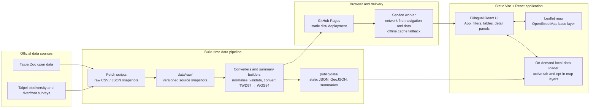

# Taipei Zoo Guide

**English** · [繁體中文](README-zh.md)

A mobile-first, bilingual guide for Taipei Zoo and Taipei nature public data. Built with Vite, React, TypeScript, and Leaflet, it serves generated local JSON files and never calls Taipei Open Data from the browser.

## What it provides

- Zoo animal, plant, exhibit-area, and event guides.
- A separate citywide biodiversity survey explorer.
- Separate historical riverfront bird and reptile observation explorers.
- Search, filters, detail drawers, map layers, data summaries, and local-data exports.
- Traditional Chinese by default, with a persisted English toggle.

## Architecture



## Important interpretation limits

This is an educational public-data explorer, not a real-time wildlife service.

- Riverfront bird and reptile records cover historical surveys from 2012–2015. They do not establish current presence, population size, habitat quality, safety, or a guaranteed sighting.
- Record count, distinct species, and summed source-recorded individuals are different measures. Do not combine them into a biodiversity score or rank areas definitively.
- “Endemic” is not a conservation-status determination; “alien” is not automatically invasive or harmful.
- Map points are source-record coordinates. Do not use them to track, capture, feed, handle, relocate, or disturb wildlife.
- The map base layer uses OpenStreetMap tiles and keeps the required contributor attribution visible. It does not require a commercial map API key.

For data-backed product recommendations and open operational risks, read the [customer dashboard advisory](docs/customer-dashboard-advisory-2026-08-13.md).

## Data sources

- [Taipei Zoo animal records](https://data.taipei/dataset/detail?id=5cb73231-b741-48b3-bec3-2ef57bb10029)
- [Taipei Zoo plant records](https://data.taipei/dataset/detail?id=48c4d6a7-4b09-4d1f-9739-ee837d302bd1)
- [Taipei biodiversity survey points](https://data.taipei/dataset/detail?id=084c5d95-7e9f-49ad-8ab9-d741a9564189)
- [Taipei riverfront bird observations](https://data.taipei/dataset/detail?id=8eea1e09-055b-4b3d-9472-b96744b1727e)
- [Taipei riverfront reptile observations](https://data.taipei/dataset/detail?id=320ee03a-7944-4033-9317-1373fa8615f8)
- [Taipei Zoo exhibit areas](https://data.taipei/dataset/detail?id=1ed45a8a-d26a-4a5f-b544-788a4071eea2)
- [Taipei Zoo events](https://data.taipei/dataset/detail?id=61ff4b3a-8a8a-47e4-96ec-e180b2abbfdb)

Raw source snapshots belong in `data/raw/`; browser-facing generated data belongs in `public/data/`.

## Static-data pipeline

```bash
npm run convert:data
```

The conversion pipeline prepares zoo, biodiversity, bird, and reptile outputs. Riverfront wildlife source coordinates are preserved as TWD97/TM2 values and converted at build time to validated WGS84 coordinates. Generated riverfront outputs include:

- `public/data/riverfront-bird-observations/observations.json`
- `public/data/riverfront-bird-observations/observations.geojson`
- `public/data/riverfront-bird-observations/metadata.json`
- `public/data/riverfront-reptile-observations/observations.json`
- `public/data/riverfront-reptile-observations/observations.geojson`
- `public/data/riverfront-reptile-observations/metadata.json`

Use individual converters when working on one dataset:

```bash
npm run data:convert:riverfront-birds
npm run data:convert:riverfront-reptiles
npm run data:convert:biodiversity
```

## Local development

Requirements: Node.js 22 or later and npm.

```bash
npm ci
npm run convert:data
npm test
npm run build
npm run dev
```

Run the GitHub Pages variant before release:

```bash
GITHUB_PAGES=true npm run build
```

On Bash-capable systems, `./init.sh` is the standard full verification path.

## Runtime performance

Datasets load on demand by tab. The initial visit loads the Animal Guide only; large biodiversity and riverfront observation files load when their corresponding section is opened. Map-only historical wildlife layers load when enabled. The service worker uses network-first data caching with an offline fallback, so returning visitors receive updated generated data when online without downloading all records during installation.

## Operational status

- Service worker v6 refreshes navigations and generated data from the network first, activates immediately, and clears prior cache versions to avoid stale releases.
- `npm audit --audit-level=moderate` is part of release verification and currently reports no advisories at that threshold.
- Use the [browser smoke test](docs/browser-smoke-test.md) before release at desktop and 390px widths.
- The Overview includes a bounded Riverfront Ecology comparison. It compares historical bird/reptile species counts only; it is not a population, habitat-quality, or current-sighting comparison.

## Project layout

- `src/` — React app, models, utilities, and unit tests.
- `scripts/` — source fetchers, converters, and summary builders.
- `data/raw/` — checked-in source snapshots.
- `public/data/` — generated local runtime datasets.
- `docs/` — product, design, and customer advisory notes.

## Licensing and media

Taipei Zoo dataset open-license application is mainly limited to text. This project does not download, re-host, transform, cache, embed, or redistribute dataset images, audio, or video; multimedia remains an external source reference.
